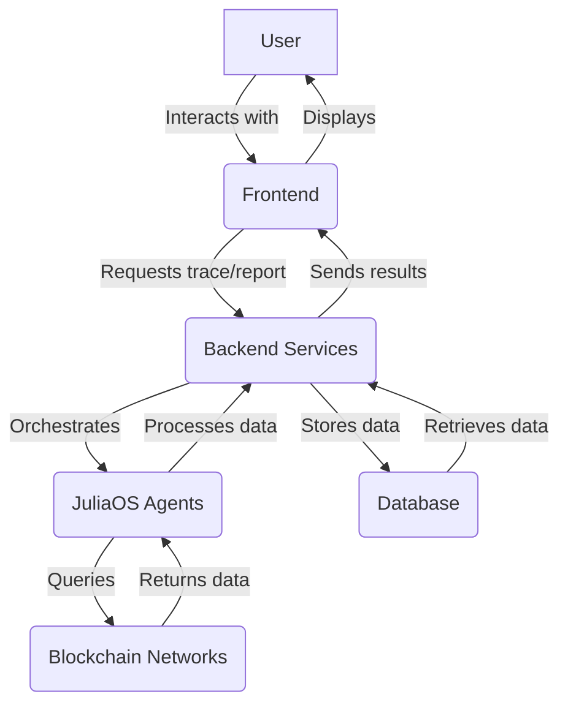

# JuliaOS Bounty dApp Design: On-Chain Transaction Trace & Compliance Agent

## 1. Introduction

This document outlines the design and architecture of an On-Chain Transaction Trace & Compliance Agent dApp, proposed as a submission for the JuliaOS bounty. The primary goal of this dApp is to leverage the unique capabilities of JuliaOS, specifically its AI-powered agents, potential for swarm orchestration, and multi-chain deployment features, to provide a robust solution for tracing suspicious transactions across various blockchain networks. This dApp aims to address the growing need for transparency and regulatory compliance within the decentralized finance (DeFi) and broader Web3 ecosystem.

## 2. Problem Statement

The rapid growth of the blockchain and cryptocurrency landscape has brought forth innovative financial paradigms, but it has also introduced new challenges, particularly in the realm of financial crime and regulatory oversight. Illicit activities, such as money laundering, fraud, and terrorist financing, often exploit the pseudonymous nature of blockchain transactions and the fragmented visibility across different chains. Tracing the flow of funds in such scenarios is a complex and time-consuming task, often requiring manual analysis and specialized tools that lack comprehensive multi-chain capabilities. Current solutions often struggle with:

*   **Multi-chain Fragmentation:** Transactions can span multiple blockchains, making it difficult to follow a complete trail.
*   **Obfuscation Techniques:** Malicious actors employ various techniques, including mixers, privacy coins, and complex transaction patterns, to obscure the origin and destination of funds.
*   **Scalability Issues:** Manual tracing is not scalable for the vast and ever-increasing volume of blockchain transactions.
*   **Lack of Intelligent Analysis:** Existing tools often provide raw data without intelligent analysis or risk assessment.

This dApp seeks to mitigate these challenges by providing an automated, AI-driven solution for comprehensive transaction tracing and compliance analysis.

## 3. dApp Concept: On-Chain Transaction Trace & Compliance Agent

Our proposed dApp, the "On-Chain Transaction Trace & Compliance Agent," will serve as an intelligent assistant for financial institutions, regulatory bodies, and blockchain forensic analysts. It will reconstruct and visualize the full path of suspicious transactions, from their origin through various obfuscation methods (mixers, bridges, multiple wallets) to their current holder. The dApp will not only trace transactions but also provide insights into potential compliance risks and generate reports for regulatory purposes.

### 3.1. Core Functionality

The dApp will offer the following core functionalities:

*   **Multi-Chain Transaction Tracing:** Ability to trace transactions across supported blockchain networks (e.g., Solana, Ethereum, Binance Smart Chain, etc.).
*   **Automated Path Reconstruction:** AI agents will automatically identify and reconstruct complex transaction paths, even those involving multiple hops and different blockchain bridges.
*   **Obfuscation Detection:** Intelligent agents will be trained to detect common obfuscation techniques, such as transactions through mixers or privacy-enhancing protocols.
*   **Risk Scoring and Compliance Analysis:** The dApp will assign risk scores to transactions and entities based on predefined compliance rules and detected anomalies. It will highlight potential violations of AML (Anti-Money Laundering) and CFT (Combating the Financing of Terrorism) regulations.
*   **Interactive Visualization:** A user-friendly interface will visualize transaction flows, showing addresses, transaction amounts, timestamps, and associated risk indicators.
*   **Reporting and Export:** Users will be able to generate detailed reports of traced transactions, suitable for regulatory submissions or internal investigations.

### 3.2. JuliaOS Integration

JuliaOS will be at the heart of this dApp, enabling its advanced capabilities:

*   **JuliaOS Agent Execution:** Individual AI agents will be responsible for specific tasks, such as:
    *   **Data Collection Agents:** Fetching transaction data from various blockchain RPCs and APIs.
    *   **Pattern Recognition Agents:** Identifying suspicious transaction patterns and obfuscation techniques.
    *   **Risk Assessment Agents:** Applying compliance rules and generating risk scores.
    *   **Multi-Chain Bridge Agents:** Understanding and tracing transactions across different blockchain bridges.
*   **Swarm Integration (Bonus Points):** For complex tracing scenarios, a swarm of specialized agents will collaborate. For example, a 

swarm could consist of a "Mixer Detection Agent," a "Cross-Chain Bridge Agent," and a "Wallet Clustering Agent" working in concert to unravel a complex transaction.
*   **Onchain Functionality:** JuliaOS's onchain interfaces will be used to:
    *   Execute onchain queries to retrieve real-time transaction data, account balances, and smart contract interactions.
    *   Potentially interact with onchain smart contracts for specific compliance checks or to mark suspicious addresses (though this would require careful consideration of privacy and decentralization principles).
*   **UI/UX Layer:** A custom frontend will be built to provide an intuitive and powerful interface for users to initiate traces, visualize results, and generate reports.

## 4. dApp Architecture

The dApp will follow a modular and scalable architecture, leveraging both on-chain and off-chain components. The core components will include:

*   **Frontend (UI/UX Layer):** A web-based application built with a modern JavaScript framework (e.g., React) to provide an interactive user interface. This layer will communicate with the backend services and directly with JuliaOS agents for certain functionalities.
*   **Backend Services (JuliaOS Agent Orchestration & Data Processing):** This layer will be responsible for:
    *   **JuliaOS Agent Management:** Orchestrating the execution of various JuliaOS AI agents (data collection, pattern recognition, risk assessment, etc.). This will involve using JuliaOS APIs to deploy, manage, and monitor agent tasks.
    *   **Data Aggregation & Storage:** Collecting and normalizing transaction data from multiple blockchain sources. A database (e.g., PostgreSQL, MongoDB) will be used to store historical transaction data, risk profiles, and compliance rules.
    *   **API Gateway:** Providing a secure and efficient interface for the frontend to interact with the backend services and JuliaOS agents.
*   **Blockchain Networks:** The dApp will interact with various blockchain networks (e.g., Solana, Ethereum, Binance Smart Chain) to retrieve raw transaction data and execute on-chain queries.
*   **JuliaOS Framework:** The underlying JuliaOS framework will provide the core AI agent capabilities, swarm orchestration, and on-chain interaction functionalities.

*Figure 1: High-Level dApp Architecture Diagram*

## 5. Technology Stack

To ensure performance, scalability, and ease of development, the following technologies will be utilized:

*   **Frontend:**
    *   **Framework:** React.js (for its component-based architecture and large ecosystem)
    *   **Styling:** Tailwind CSS (for rapid UI development and responsive design)
    *   **State Management:** Redux or Zustand (for predictable state management)
*   **Backend:**
    *   **Language:** Python (for its strong ecosystem in AI/ML and ease of integration with JuliaOS Python bindings)
    *   **Framework:** FastAPI (for building high-performance APIs)
    *   **Database:** PostgreSQL (for structured transaction data and compliance rules) or MongoDB (for flexible storage of raw blockchain data)
    *   **Containerization:** Docker (for consistent development and deployment environments)
*   **Blockchain Interaction:**
    *   **JuliaOS Onchain Interfaces:** For direct interaction with blockchain networks.
    *   **Web3.py / Ethers.js:** For direct interaction with Ethereum-compatible chains if JuliaOS interfaces are not sufficient for specific needs.
*   **Smart Contracts:**
    *   **Language:** Solidity (for Ethereum-compatible chains) or Rust (for Solana)
    *   **Development Environment:** Hardhat or Foundry (for Ethereum) / Anchor (for Solana)
*   **AI/ML:**
    *   **JuliaOS Agents:** Leveraging JuliaOS's built-in AI capabilities.
    *   **Python Libraries:** scikit-learn, pandas, numpy (for data preprocessing and custom ML models if needed).

## 6. JuliaOS Agent Design

The core intelligence of the dApp will reside in its JuliaOS AI agents. Each agent will be designed to perform a specific task, contributing to the overall transaction tracing and compliance analysis. Here's a breakdown of key agent types:

*   **Blockchain Data Collection Agent:**
    *   **Purpose:** To fetch raw transaction data, block information, and account details from various blockchain networks.
    *   **Inputs:** Blockchain network (e.g., "Solana", "Ethereum"), block range, transaction hash, or address.
    *   **Outputs:** Raw JSON data of transactions, blocks, and account states.
    *   **JuliaOS API:** `agent.useLLM()` for intelligent parsing of blockchain data or direct API calls to blockchain nodes.
*   **Transaction Path Reconstruction Agent:**
    *   **Purpose:** To reconstruct the flow of funds from an origin address to a destination, identifying intermediate addresses and transactions.
    *   **Inputs:** Starting address/transaction hash, target address (optional), depth of trace.
    *   **Outputs:** A graph representation of the transaction path, including all intermediate transactions and addresses.
    *   **JuliaOS API:** `agent.useLLM()` for heuristic-based pathfinding, potentially combined with custom algorithms.
*   **Obfuscation Detection Agent:**
    *   **Purpose:** To identify patterns indicative of obfuscation techniques (e.g., mixer usage, bridge hopping, coinjoin).
    *   **Inputs:** Transaction path data from the Reconstruction Agent.
    *   **Outputs:** Flags indicating detected obfuscation methods, confidence scores.
    *   **JuliaOS API:** `agent.useLLM()` for pattern recognition, potentially fine-tuned with specific obfuscation datasets.
*   **Risk Assessment Agent:**
    *   **Purpose:** To assign risk scores to addresses and transactions based on predefined compliance rules, blacklists, and detected anomalies.
    *   **Inputs:** Transaction path data, detected obfuscation methods, external blacklists/whitelists.
    *   **Outputs:** Risk score (e.g., 0-100), list of violated compliance rules, recommendations.
    *   **JuliaOS API:** `agent.useLLM()` for rule-based reasoning and anomaly detection.
*   **Swarm Orchestration (for complex cases):**
    *   For highly complex or multi-chain traces, a "Master Orchestrator Agent" will coordinate a swarm of specialized agents. For example, if a transaction involves a cross-chain bridge, the Master Orchestrator will dispatch a "Cross-Chain Bridge Agent" to trace the funds on the destination chain, while a "Mixer Detection Agent" simultaneously analyzes the transaction history for mixer usage.
    *   **JuliaOS API:** `swarm.coordinate()` or similar APIs for inter-agent communication and task distribution.

## 7. UI/UX Design Considerations

The frontend will prioritize clarity, ease of use, and effective visualization of complex data. Key UI/UX elements will include:

*   **Dashboard:** A central dashboard providing an overview of recent traces, high-risk alerts, and quick access to tracing functionalities.
*   **Trace Input:** A clear input field for users to enter a starting address or transaction hash, along with options for specifying target chains or trace depth.
*   **Interactive Graph Visualization:** The core of the UI will be an interactive graph that visually represents the transaction flow. Users should be able to:
    *   Zoom in/out and pan across the graph.
    *   Click on nodes (addresses) or edges (transactions) to view detailed information.
    *   Filter transactions by type, amount, or risk score.
    *   Highlight suspicious paths or entities.
*   **Detailed Information Panels:** When an address or transaction is selected, a side panel will display comprehensive details, including:
    *   Transaction hash, block number, timestamp.
    *   Input/output addresses and amounts.
    *   Associated risk score and detected anomalies.
    *   Links to external block explorers.
*   **Reporting Interface:** A dedicated section for generating and exporting compliance reports in various formats (e.g., PDF, CSV).
*   **Settings/Configuration:** Users should be able to configure their preferred blockchain networks, API keys, and custom compliance rules.

## 8. Development Roadmap (High-Level)

1.  **Phase 1: Core Agent Development & Backend (Weeks 1-3)**
    *   Set up JuliaOS development environment.
    *   Develop and test Blockchain Data Collection Agent.
    *   Develop and test Transaction Path Reconstruction Agent.
    *   Build FastAPI backend for agent orchestration and data storage.
    *   Integrate with PostgreSQL/MongoDB.
2.  **Phase 2: Frontend Development & Integration (Weeks 4-6)**
    *   Develop React frontend with core UI components.
    *   Integrate frontend with backend APIs.
    *   Implement interactive graph visualization.
3.  **Phase 3: Advanced Agents & Swarm Integration (Weeks 7-8)**
    *   Develop Obfuscation Detection Agent.
    *   Develop Risk Assessment Agent.
    *   Implement Swarm Orchestration for complex traces.
4.  **Phase 4: Reporting & Refinements (Week 9)**
    *   Develop reporting functionality.
    *   UI/UX refinements and user testing.
    *   Performance optimization.
5.  **Phase 5: Documentation & Deployment (Week 10)**
    *   Write comprehensive documentation (README, API docs, deployment guide).
    *   Prepare for deployment and final testing.

## 9. Conclusion

This On-Chain Transaction Trace & Compliance Agent dApp, powered by JuliaOS, offers a compelling solution to a critical problem in the blockchain ecosystem. By combining AI-driven intelligence with multi-chain capabilities and a user-friendly interface, it aims to provide a powerful tool for enhancing transparency and combating illicit activities. We believe this dApp will not only demonstrate the versatility and power of the JuliaOS framework but also contribute significantly to the broader Web3 community by fostering a more secure and compliant environment.

## 10. References

[1] JuliaOS Official Website: [https://juliaos.com/](https://juliaos.com/)
[2] JuliaOS Gitbook (Documentation): [https://docs.juliaos.com/](https://docs.juliaos.com/)
[3] JuliaOS GitHub: [https://github.com/juliaos](https://github.com/juliaos)
[4] JuliaOS X Page: [https://x.com/juliaos_](https://x.com/juliaos_)
[5] JuliaOS Discord: [https://discord.com/invite/juliaos](https://discord.com/invite/juliaos)

